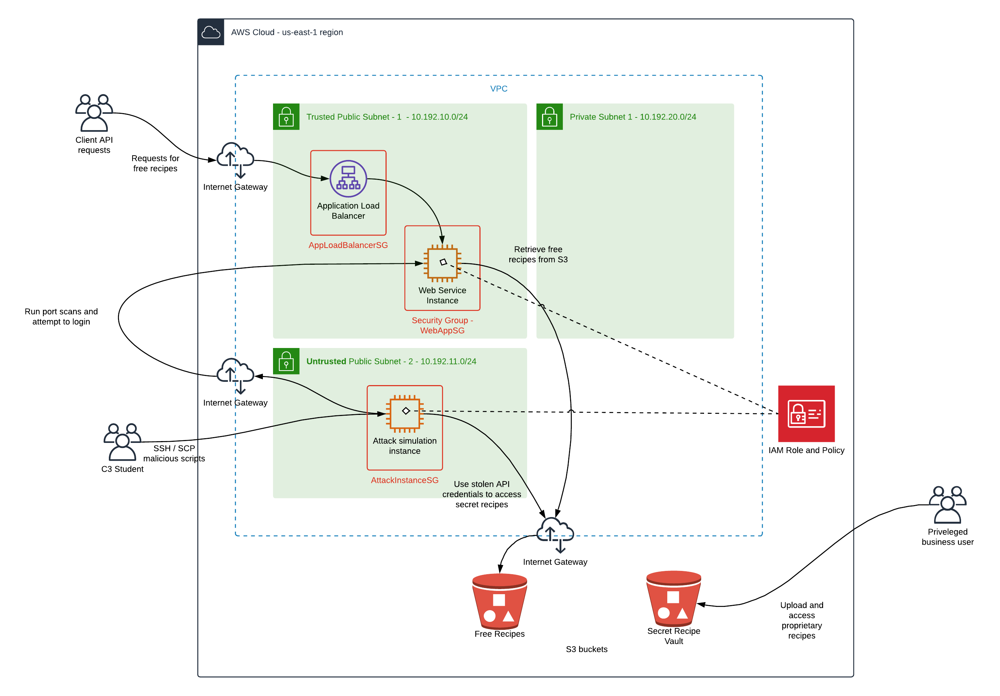

# Cloud Security - Secure the Recipe Vault Web Application
 
In this project, you will:
 
* Deploy and assess a simple web application environment’s security posture
* Test the security of the environment by simulating attack scenarios and exploiting cloud configuration vulnerabilities
* Implement monitoring to identify insecure configurations and malicious activity 
* Incrementally harden and secure the environment using various techniques to ensure the security of the data and infrastructure
* Design a DevSecOps pipeline which would enable the hardening to source controlled and automated
 
## Dependencies and Prerequisites
 
### Installation of the AWS CLI and Local Setup of AWS API keys
Instructions and examples in this project will make use of the AWS CLI in order to automate and reduce time and complexity.
Refer to the below links to get the AWS CLI installed and configured in your local environment.
 
[Installing the CLI](https://docs.aws.amazon.com/cli/latest/userguide/install-cliv2.html)
 
[Configuring the CLI](https://docs.aws.amazon.com/cli/latest/userguide/cli-chap-configure.html)
 
## Initial Environment - Prior to Hardening
  
The architecture of the environment, prior to hardening, is described by the diagam below. It includes a number of poor security practices, which were to be exploited via an attack simulation, before incrementally hardening the infrastructure.
 

 
#### Expected user flow:
- Clients will invoke a public-facing web service to pull free recipes.  
- The web service is hosted by an HTTP load balancer listening on port 80.
- The web service is forwarding requests to the web application instance which listens on port 5000.
- The web application instance will, in turn, use the public-facing AWS API to pull recipe files from the S3 bucket hosting free recipes. An IAM role and policy will provide the web app instance permissions required to access objects in the S3 bucket.
- Another S3 bucket is used as a vault to store secret recipes; there are privileged users who would need access to this bucket. The web application server does not need access to this bucket.
 
#### Attack flow:
- Scripts simulating an attack will be run from a separate instance which is in an un-trusted subnet.
- The scripts will attempt to break into the web application instance using the public IP and attempt to access data in the secret recipe S3 bucket.
 
### Getting Started
Full instructions can be found [here](INSTRUCTIONS.md), but to get up and running quickly, run the following commands to deploy each of the three initial CloudFormation stacks, via the AWS CLI. 
 
##### Deploy the S3 buckets
```
aws cloudformation create-stack --region us-east-1 --stack-name c3-s3 --template-body file://src/c3-s3.yml
```
 
Expected example output:
```
{
    "StackId": "arn:aws:cloudformation:us-east-1:4363053XXXXXX:stack/c3-s3/70dfd370-2118-11ea-aea4-12d607a4fd1c"
}
```
##### Deploy the VPC and Subnets
```
aws cloudformation create-stack --region us-east-1 --stack-name c3-vpc --template-body file://src/c3-vpc.yml
```
 
Expected example output:
```
{
    "StackId": "arn:aws:cloudformation:us-east-1:4363053XXXXXX:stack/c3-vpc/70dfd370-2118-11ea-aea4-12d607a4fd1c"
}
```
 
##### Deploy the Application Stack 
You will need to specify a pre-existing key-pair name.
```
aws cloudformation create-stack --region us-east-1 --stack-name c3-app --template-body file://src/c3-app.yml --parameters ParameterKey=KeyPair,ParameterValue=<add your key pair name here> --capabilities CAPABILITY_IAM
```
 
Expected example output:
```
{
    "StackId": "arn:aws:cloudformation:us-east-1:4363053XXXXXX:stack/c3-app/70dfd370-2118-11ea-aea4-12d607a4fd1c"
}
```
 
#### Upload data to S3 buckets
Upload the free recipes to the free recipe S3 bucket from step 2. Do this by typing this command into the console (you will replace `<BucketNameRecipesFree>` with your bucket name):
 
Example:  
```
aws s3 cp free_recipe.txt s3://<BucketNameRecipesFree>/ --region us-east-1
```
 
Upload the secret recipes to the secret recipe S3 bucket from step 2. Do this by typing this command into the console (you will replace `<BucketNameRecipesSecret>` with your bucket name):
 
Example:  
```
aws s3 cp secret_recipe.txt s3://<BucketNameRecipesSecret>/ --region us-east-1
```
 
#### Test the application
Invoke the web service using the application load balancer URL:
```
http://<ApplicationURL>/free_recipe
```
You should receive a recipe for banana bread.

The AMIs specified in the cloud formation template exist in the us-east-1 (N. Virginia) region. You will need to set this as your default region when deploying resources for this project.
 
 
### Security Monitoring & Hardening using AWS Native Tools
 
Some of the AWS tools and services used to provide analysis, visibility and remediation of the security posture of the application were as follows:

- AWS Config
- AWS Inspector
- AWS GuardDuty
- AWS SecurityHub
- AWS KMS
- AWS WAF
- AWS IAM
- AWS CloudFormation
- AWS VPC
- AWS SecurityGroups
  


